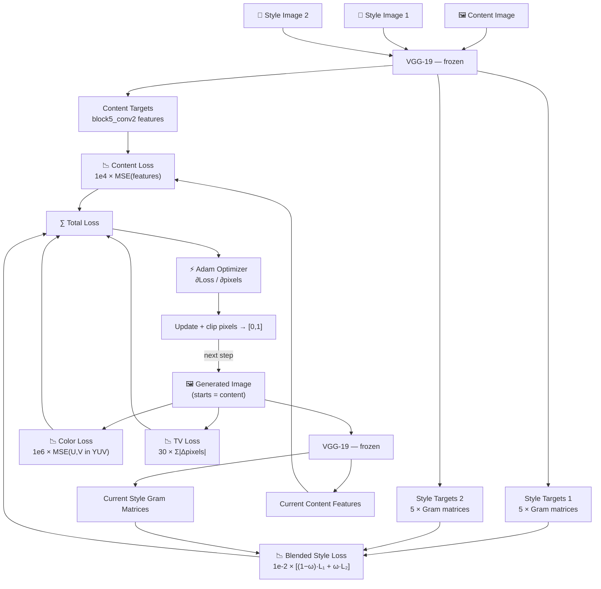
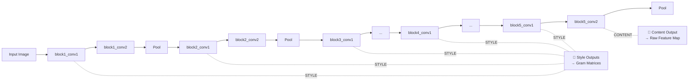
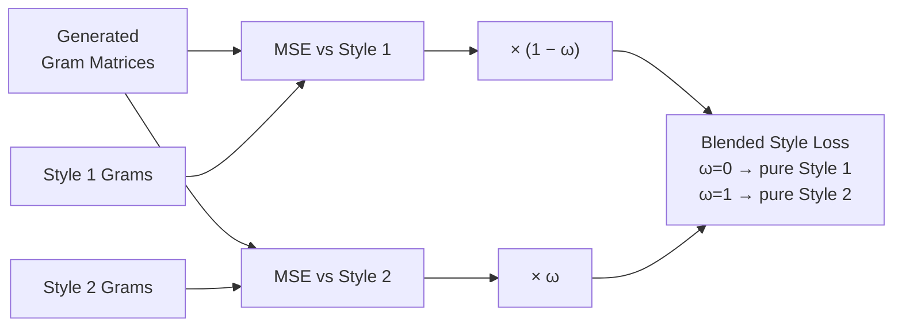
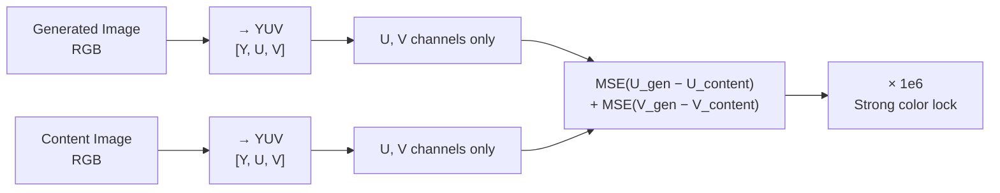

# 🎨 Artistic Vision — Controllable Neural Style Transfer for Image Synthesis

[](https://python.org)
[](https://tensorflow.org)
[](https://streamlit.io)

This project implements a **Controllable Neural Style Transfer (NST)** system that extends the
original Gatys et al. method with two novel contributions:

1. **Style Interpolation** — Blend between two distinct artistic styles using a single
   interpolation weight `ω` (e.g., 30 % Style A + 70 % Style B).
2. **Color Preservation** — Retain the original content colours by penalising chrominance
   differences in the YUV colour space.

The result is a controllable, high-quality stylisation system ideal for digital art generation
and creative design.

---

## ✨ Features

| Feature | Detail |
|---------|--------|
| Style interpolation | Blend two styles with a single parameter `ω ∈ [0, 1]` |
| Color preservation | YUV-space loss keeps the original colour palette |
| Noise reduction | Total-variation (TV) loss suppresses pixel artefacts |
| Streamlit app | Interactive web UI with live preview and download |
| CLI trainer | `train.py` runs the full pipeline from the terminal |
| Modular codebase | Separate packages for model, losses, and utilities |

---

## 📁 Project Structure

```
.
├── controlled_style_transfer.ipynb   ← Main Google Colab notebook
├── app.py                            ← Streamlit web application
├── train.py                          ← Command-line training script
├── config.py                         ← All hyperparameters in one place
│
├── model/
│   ├── __init__.py
│   └── vgg_model.py                  ← VGG-19 feature extractor + Gram matrix
│
├── losses/
│   ├── __init__.py
│   └── nst_losses.py                 ← Content, style, color, TV loss functions
│
├── utils/
│   ├── __init__.py
│   └── image_utils.py                ← Image load / save / display helpers
│
├── requirements.txt                  ← Pinned dependencies
├── .gitignore
│
├── content.jpg                       ← Sample content image
├── style1.jpg                        ← Sample style image 1
├── style2.jpg                        ← Sample style image 2
├── interp_0.0.png                    ← Output: 100 % style 1
├── interp_0.25.png                   ← Output: 75 % style 1 / 25 % style 2
├── interp_0.50.png                   ← Output: 50/50 blend
├── interp_0.75.png                   ← Output: 25 % style 1 / 75 % style 2
├── interp_1.0.png                    ← Output: 100 % style 2
├── color_preserved_blend.png         ← Output: colour-preserved blend
├── method_img.png                    ← Architecture and loss-flow diagram
└── Project_Report.pdf                ← Full technical report
```

---

## 🚀 Quick Start

### 1. Install dependencies

```bash
pip install -r requirements.txt
```

### 2. Run the Streamlit web app

```bash
streamlit run app.py
```

Upload your own images, adjust the `ω` slider, and hit **Run Style Transfer**.

### 3. Run from the command line

```bash
python train.py \
    --content content.jpg \
    --style1  style1.jpg  \
    --style2  style2.jpg  \
    --output  result.png  \
    --omega   0.5         \
    --epochs  10          \
    --steps   100
```

Full CLI options:

| Flag | Default | Description |
|------|---------|-------------|
| `--content` | `content.jpg` | Content image path |
| `--style1` | `style1.jpg` | Style image 1 path |
| `--style2` | `style2.jpg` | Style image 2 path |
| `--output` | `output_result.png` | Output image path |
| `--omega` | `0.5` | Style interpolation weight ω |
| `--epochs` | `10` | Training epochs |
| `--steps` | `100` | Steps per epoch |
| `--no-color` | — | Disable color-preservation loss |
| `--no-tv` | — | Disable total-variation loss |
| `--save-epochs` | — | Save image after each epoch |

### 4. Google Colab (GPU)

Open `controlled_style_transfer.ipynb` in Google Colab, enable the **T4 GPU** runtime,
and run all cells.

---

## 🧠 Technical Overview

### Full System Architecture

The system uses a **frozen VGG-19** network pre-trained on ImageNet as a perceptual feature
extractor. No VGG-19 weights are updated during training — only the pixel values of the
generated image are optimised.



### VGG-19 Layer Tapping



### Style Blending (Novelty 1)



### Color Preservation (Novelty 2)



### Loss Functions Summary

| Loss | Weight | Purpose |
|------|--------|---------|
| **Content loss** | `1e4` | L2 distance between `block5_conv2` features — preserves structure |
| **Blended style loss** | `1e-2` | `(1−ω)·L_style1 + ω·L_style2` via Gram matrices — blends two styles |
| **Color preservation** | `1e6` | MSE on U, V channels in YUV space — keeps original colours |
| **Total variation** | `30.0` | Penalises adjacent pixel differences — reduces noise & artefacts |

### Hyperparameters

All defaults live in [`config.py`](config.py):

```python
CONTENT_WEIGHT       = 1e4
STYLE_WEIGHT         = 1e-2
COLOR_WEIGHT         = 1e6
TV_WEIGHT            = 30.0
INTERPOLATION_WEIGHT = 0.5   # ω
EPOCHS               = 10
STEPS_PER_EPOCH      = 100
```

---

## 📊 Results

Interpolation from Style 1 (ω = 0) to Style 2 (ω = 1):

| ω = 0.0 | ω = 0.25 | ω = 0.50 | ω = 0.75 | ω = 1.0 |
|---------|---------|---------|---------|---------|
|  |  |  |  |  |

Color-preserved blend:


---

## 📄 Report

A full technical report (method, experiments, ablation study, conclusions) is available in
[`Project_Report.pdf`](Project_Report.pdf).

---

## 📚 References

- Gatys, L.A., Ecker, A.S., Bethge, M. (2015). *A Neural Algorithm of Artistic Style*. arXiv:1508.06576
- Simonyan, K., Zisserman, A. (2014). *Very Deep Convolutional Networks for Large-Scale Image Recognition*. arXiv:1409.1556
- Johnson, J. et al. (2016). *Perceptual Losses for Real-Time Style Transfer and Super-Resolution*. ECCV 2016
