# 🎨 Artistic Vision — Controllable Neural Style Transfer for Image Synthesis

[](https://python.org)
[](https://tensorflow.org)
[](https://streamlit.io)
[](LICENSE)

> **Transform any photograph into a masterpiece.** This project implements a **Controllable Neural Style Transfer (NST)** system that lets you blend two artistic styles together and preserve original colors — giving you pixel-perfect artistic control over the output.

---

## 📌 Table of Contents

1. [What This Project Does](#-what-this-project-does)
2. [Novel Contributions](#-novel-contributions)
3. [How It Works — The Big Picture](#-how-it-works--the-big-picture)
4. [Architecture Deep Dive](#-architecture-deep-dive)
5. [VGG-19 Feature Extractor](#-vgg-19-feature-extractor)
6. [Loss Functions Explained](#-loss-functions-explained)
7. [Training Loop](#-training-loop)
8. [Project Structure](#-project-structure)
9. [Quick Start](#-quick-start)
10. [Parameter Guide](#-parameter-guide)
11. [Results](#-results)
12. [References](#-references)

---

## 🖼️ What This Project Does

Neural Style Transfer (NST) is a deep learning technique that combines the **content** of one image with the **artistic style** of another. Given:

- A **Content Image** (e.g., a landscape photo)
- A **Style Image** (e.g., Van Gogh's *Starry Night*)

The system generates a brand-new image that looks like your photo *painted* in the style of the artwork — while preserving the original shapes, structures, and scene layout.

This project extends the classic NST algorithm with **two novel contributions** that give you unprecedented control over the output.

---

## ✨ Novel Contributions

### Novelty 1 — Dual-Style Interpolation

Standard NST uses a single style image. This project supports **two style images simultaneously**, blended by a single parameter `ω`:

```
Output Style = (1 − ω) × Style_1 + ω × Style_2
```

- `ω = 0.0` → Pure Style 1
- `ω = 0.5` → Equal blend of both
- `ω = 1.0` → Pure Style 2

### Novelty 2 — YUV Color Preservation

Standard NST always adopts the colors of the painting. This project adds a **chrominance loss** in YUV color space that locks in the original photo's colors while only transferring texture patterns:

```
L_color = MSE(U_generated, U_content) + MSE(V_generated, V_content)
```

By penalizing only the U and V (color) channels and leaving Y (brightness) free, style textures are applied without changing the underlying color palette.

---

## 🧠 How It Works — The Big Picture

Neural Style Transfer is an **optimization problem**, not a training problem. A pre-trained VGG-19 network is used purely as a **perceptual judge** — its weights are never changed. Instead, we start with the content image and iteratively update its pixel values until it simultaneously:

1. **Looks structurally like** the content photo (measured by VGG-19 feature similarity)
2. **Has the texture/feel of** the target painting(s) (measured by Gram matrix similarity)

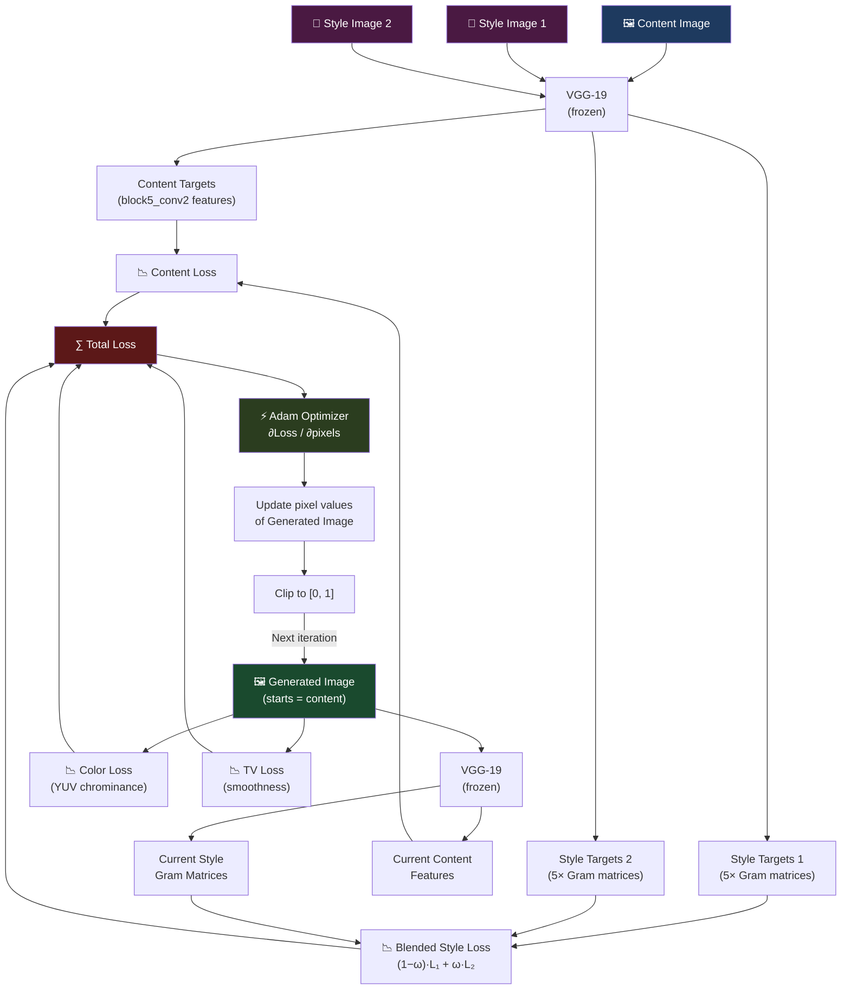

---

## 🏗️ Architecture Deep Dive

### System Component Map

```mermaid
flowchart LR
    subgraph INPUT["📥 Input Layer"]
        CI["content.jpg"]
        S1["style1.jpg"]
        S2["style2.jpg"]
    end

    subgraph UTIL["🔧 utils/image_utils.py"]
        LOAD["load_img()\n• Read file / numpy array\n• Resize → max 512px\n• Normalize → [0, 1]\n• Add batch dim [1,H,W,3]"]
    end

    subgraph MODEL["🧠 model/vgg_model.py"]
        VGG["VGG-19\n(ImageNet weights, frozen)"]
        GRAM["gram_matrix()\nF × Fᵀ / (H×W)\n→ texture statistics"]
        SCM["StyleContentModel\n.call() → {style, content}"]
    end

    subgraph LOSS["📉 losses/nst_losses.py"]
        CL["content_loss()\n1e4 × MSE(features)"]
        BSL["blended_style_loss()\n1e-2 × [(1−ω)L₁ + ωL₂]"]
        CPL["color_preservation_loss()\n1e6 × MSE(U,V channels)"]
        TVL["total_variation_loss()\n30 × Σ|Δpixels|"]
        TL["total_loss() → scalar"]
    end

    subgraph OPT["⚡ Optimizer"]
        ADAM["Adam\nlr=0.02, β₁=0.99, ε=0.1"]
        GRAD["GradientTape\n∂Loss/∂image"]
        CLIP["clip_by_value(0, 1)"]
    end

    subgraph UI["🖥️ app.py — Streamlit"]
        CTRL["Sidebar Controls\nω, epochs, steps\ncolor/TV toggles"]
        PROG["Live Progress\nper-epoch preview"]
        DL["Download button\nPNG output"]
    end

    INPUT --> UTIL --> MODEL
    MODEL --> LOSS --> OPT --> OPT
    CTRL --> UI
    PROG --> UI
    DL --> UI
    OPT -->|pixel update| MODEL

    style INPUT fill:#0d2137,stroke:#2a6496
    style UTIL fill:#1a2e1a,stroke:#4caf50
    style MODEL fill:#2a1a0d,stroke:#ff9800
    style LOSS fill:#2a0d0d,stroke:#f44336
    style OPT fill:#1a1a2a,stroke:#9c27b0
    style UI fill:#0d2a2a,stroke:#00bcd4
```

---

## 🔬 VGG-19 Feature Extractor

VGG-19 is a 19-layer deep CNN trained to classify 1,000 ImageNet categories. Its layers naturally learn a hierarchy of visual features — from simple edges at shallow layers to complex object parts at deep layers. We exploit this hierarchy by tapping different layers for content vs. style.

### VGG-19 Block Structure

```mermaid
flowchart LR
    Input["Input\n[1, H, W, 3]"] --> B1

    subgraph B1["Block 1 — Edges"]
        b1c1["Conv2D 64"] --> b1c2["Conv2D 64"] --> p1["MaxPool\n↓ ½"]
    end

    subgraph B2["Block 2 — Corners"]
        p1 --> b2c1["Conv2D 128"] --> b2c2["Conv2D 128"] --> p2["MaxPool\n↓ ½"]
    end

    subgraph B3["Block 3 — Textures"]
        p2 --> b3c1["Conv2D 256"] --> b3c2["Conv2D 256"] --> b3c3["Conv2D 256"] --> b3c4["Conv2D 256"] --> p3["MaxPool\n↓ ½"]
    end

    subgraph B4["Block 4 — Patterns"]
        p3 --> b4c1["Conv2D 512"] --> b4c2["Conv2D 512"] --> b4c3["Conv2D 512"] --> b4c4["Conv2D 512"] --> p4["MaxPool\n↓ ½"]
    end

    subgraph B5["Block 5 — Objects"]
        p4 --> b5c1["Conv2D 512"] --> b5c2["Conv2D 512"] --> b5c3["Conv2D 512"] --> b5c4["Conv2D 512"] --> p5["MaxPool\n↓ ½"]
    end

    b1c1 -. "STYLE\nblock1_conv1" .- STYLE
    b2c1 -. "STYLE\nblock2_conv1" .- STYLE
    b3c1 -. "STYLE\nblock3_conv1" .- STYLE
    b4c1 -. "STYLE\nblock4_conv1" .- STYLE
    b5c1 -. "STYLE\nblock5_conv1" .- STYLE
    b5c2 -. "CONTENT\nblock5_conv2" .- CONTENT

    STYLE["🎨 Style Outputs\n→ Gram Matrices"]
    CONTENT["📐 Content Output\n→ Raw Feature Maps"]
```

| Layer | Used For | Why |
|---|---|---|
| `block1_conv1` | Style | Captures fine-grain texture, micro-strokes |
| `block2_conv1` | Style | Edge textures, color gradients |
| `block3_conv1` | Style | Medium-scale patterns |
| `block4_conv1` | Style | Large structural patterns |
| `block5_conv1` | Style | Coarse, high-level style patterns |
| `block5_conv2` | **Content** | Deep semantic features — "what is in the scene" |

### The Gram Matrix — How Style is Measured

The Gram matrix captures **co-occurrence statistics** of features — which textures appear together, regardless of *where* in the image they appear. This is what makes it position-independent (Van Gogh's swirling lines appear everywhere in his paintings).

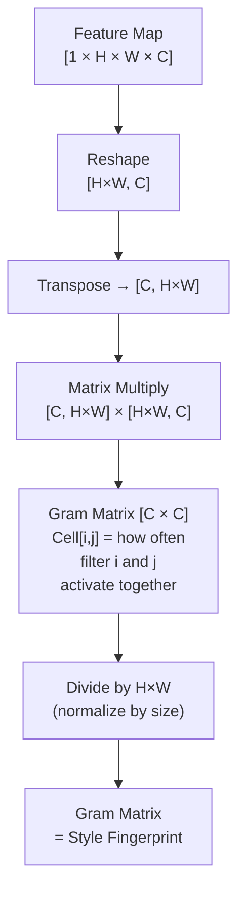

---

## 📉 Loss Functions Explained

### 1. Content Loss

Preserves the structural layout of the content image by comparing deep VGG-19 feature maps.

```
L_content = α/N × Σ mean[(F_generated − F_content)²]

α = CONTENT_WEIGHT = 1e4
N = number of content layers = 1
Layer used: block5_conv2
```

### 2. Blended Style Loss *(Novelty 1)*

Compares Gram matrices across 5 VGG layers, blended between two style images using `ω`.

```
L_style1 = Σ mean[(G_generated − G_style1)²]
L_style2 = Σ mean[(G_generated − G_style2)²]

L_blended = β/N × [(1−ω)·L_style1 + ω·L_style2]

β = STYLE_WEIGHT = 1e-2
N = number of style layers = 5
```

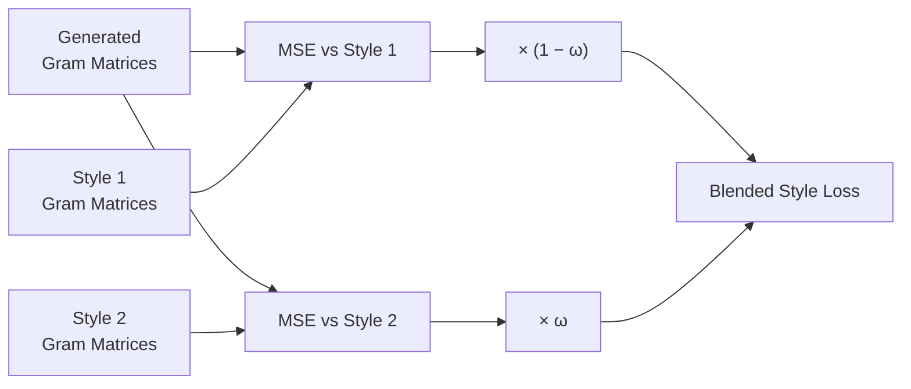

### 3. Color Preservation Loss *(Novelty 2)*

Converts images to YUV space and penalizes only the U, V (chrominance) channels — keeping colors identical to the content image while letting brightness shift freely for stylistic lighting.

```
gen_yuv     = rgb_to_yuv(generated_image)
content_yuv = rgb_to_yuv(content_image)

L_color = γ × mean[(gen_yuv[U,V] − content_yuv[U,V])²]

γ = COLOR_WEIGHT = 1e6   (deliberately very large)
```

### 4. Total Variation Loss

Reduces pixel-level noise and checkerboard artifacts by penalizing large differences between adjacent pixels.

```
L_tv = δ × Σ(|pixel[i,j] − pixel[i+1,j]| + |pixel[i,j] − pixel[i,j+1]|)

δ = TV_WEIGHT = 30.0
```

### Combined Loss

```
L_total = L_content + L_blended_style + L_color (if ON) + L_tv (if ON)
```

| Loss | Weight | Magnitude Balance |
|---|---|---|
| Content | `1e4` | Keeps structure visible |
| Style | `1e-2` | Raw style loss is huge; weight scales it down |
| Color | `1e6` | Very strong — color must not drift |
| TV | `30.0` | Gentle smoothing regularizer |

---

## 🔄 Training Loop

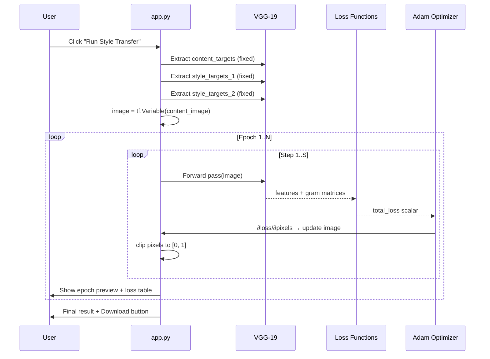

---

## 📁 Project Structure

```
.
├── app.py                            ← Streamlit web app (UI + training loop)
├── train.py                          ← CLI training script
├── config.py                         ← All hyperparameters
├── requirements.txt
│
├── model/
│   └── vgg_model.py                  ← VGG-19 extractor + Gram matrix
│
├── losses/
│   └── nst_losses.py                 ← Content, style, color, TV losses
│
├── utils/
│   └── image_utils.py                ← load_img, tensor_to_image, save_image
│
├── content.jpg                       ← Default content image
├── style1.jpg                        ← Default style 1
├── style2.jpg                        ← Default style 2
│
├── interp_0.0.png                    ← Output: ω = 0.0 (100% Style 1)
├── interp_0.25.png                   ← Output: ω = 0.25
├── interp_0.50.png                   ← Output: ω = 0.5 (50/50 blend)
├── interp_0.75.png                   ← Output: ω = 0.75
├── interp_1.0.png                    ← Output: ω = 1.0 (100% Style 2)
├── color_preserved_blend.png         ← Color-preservation result
├── method_img.png                    ← Architecture diagram
└── Project_Report.pdf                ← Full technical report
```

### Module Dependency Graph

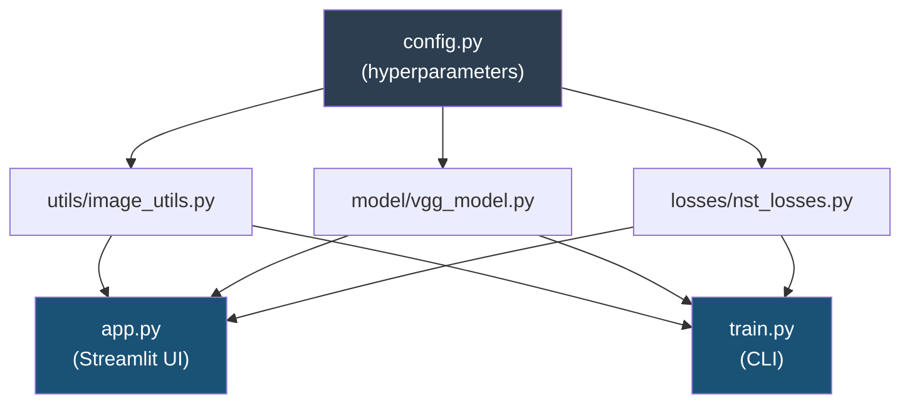

---

## 🚀 Quick Start

### Installation

```bash
# Using the provided virtual environment on D: drive (Windows)
D:\nst_venv\Scripts\python -m streamlit run app.py

# OR in any Python 3.12 environment
pip install -r requirements.txt
streamlit run app.py
```

### CLI Usage

```bash
python train.py \
    --content content.jpg \
    --style1  style1.jpg  \
    --style2  style2.jpg  \
    --output  result.png  \
    --omega   0.5         \
    --epochs  10          \
    --steps   100
```

| Flag | Default | Description |
|------|---------|-------------|
| `--content` | `content.jpg` | Content image path |
| `--style1` | `style1.jpg` | Style image 1 |
| `--style2` | `style2.jpg` | Style image 2 |
| `--output` | `output_result.png` | Output path |
| `--omega` | `0.5` | Style blend weight ω |
| `--epochs` | `10` | Training epochs |
| `--steps` | `100` | Steps per epoch |
| `--no-color` | — | Disable color-preservation |
| `--no-tv` | — | Disable TV smoothing |
| `--save-epochs` | — | Save image after each epoch |

### Google Colab (GPU — Recommended)

Open `controlled_style_transfer.ipynb` in Google Colab, enable **T4 GPU** runtime, and run all cells. GPU acceleration makes training ~20× faster.

---

## ⚙️ Parameter Guide

All defaults live in [`config.py`](config.py):

```python
CONTENT_WEIGHT       = 1e4    # Higher → stronger content structure preservation
STYLE_WEIGHT         = 1e-2   # Higher → more aggressive style transfer
COLOR_WEIGHT         = 1e6    # Higher → colors locked closer to content
TV_WEIGHT            = 30.0   # Higher → smoother, less noisy output
INTERPOLATION_WEIGHT = 0.5    # ω: 0 = Style1, 1 = Style2
EPOCHS               = 10     # Training cycles (each shows a preview)
STEPS_PER_EPOCH      = 100    # Steps within each epoch
LEARNING_RATE        = 0.02   # Adam step size
IMAGE_MAX_DIM        = 512    # Longest image dimension in pixels
```

### Effect of ω (Interpolation Weight)

| ω | Effect |
|---|---|
| `0.0` | 100% Style Image 1 |
| `0.25` | 75% Style 1 + 25% Style 2 |
| `0.5` | Perfect 50/50 blend |
| `0.75` | 25% Style 1 + 75% Style 2 |
| `1.0` | 100% Style Image 2 |

### Recommended Settings

| Use Case | Epochs | Steps | Color | TV |
|---|---|---|---|---|
| Quick preview | 5 | 50 | ON | ON |
| Good quality | 10 | 100 | ON | ON |
| Best quality | 20 | 100 | ON | ON |
| Pure style (no color) | 10 | 100 | OFF | ON |
| Max artistic chaos | 10 | 100 | OFF | OFF |

> **Note:** Total training updates = Epochs × Steps. On CPU, expect ~3 min/epoch at 100 steps. Use Google Colab with GPU for 20× speedup.

---

## 📊 Results

### Style Interpolation (ω sweep, Color Preservation ON)

| ω = 0.0 | ω = 0.25 | ω = 0.50 | ω = 0.75 | ω = 1.0 |
|---------|---------|---------|---------|---------|
| 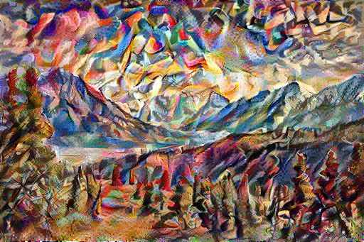 | 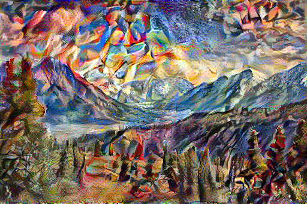 | 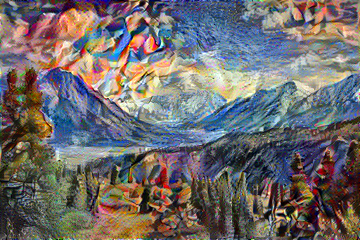 | 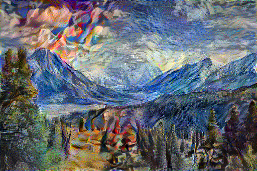 | 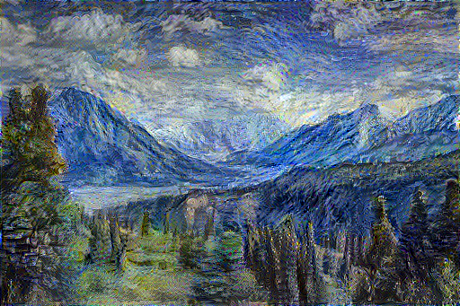 |

*The mountain landscape progressively shifts from Style 1 to Style 2 as ω increases from 0 → 1.*

### Color Preservation


*Left: Standard NST (colors from painting). Right: YUV color-preserved result (original photo colors retained).*

---

## 📄 Report

A full technical report covering the method, ablation study, experiments, and conclusions is available in [`Project_Report.pdf`](Project_Report.pdf).

---

## 📚 References

- Gatys, L.A., Ecker, A.S., Bethge, M. (2015). *A Neural Algorithm of Artistic Style*. [arXiv:1508.06576](https://arxiv.org/abs/1508.06576)
- Simonyan, K., Zisserman, A. (2014). *Very Deep Convolutional Networks for Large-Scale Image Recognition*. [arXiv:1409.1556](https://arxiv.org/abs/1409.1556)
- Johnson, J. et al. (2016). *Perceptual Losses for Real-Time Style Transfer and Super-Resolution*. ECCV 2016.
